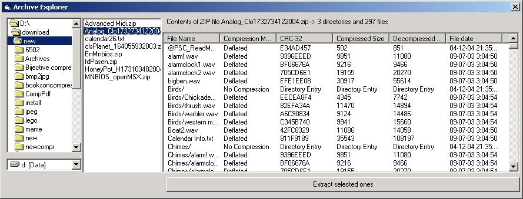



## Archive Explorer \(update 1\)

### Description

This programm is capable of showing the contents of different archives

and some archives can be extracted.

Archives which contents can be shown are.

ZIP,GZ,TGZ,TAR,ARC,ARJ,RAR,CAB,LZH,LHA

Archives which contents can be extracted are.

ZIP,GZ,TGZ,TAR

All coding is done in vb without use of third party components so everybody

who needs to unzip something in there project can use this one so the need for

third party components will be absolete.

Don't expect it to be fast but it is as fast as we could get it.

it is far from Finished but since i haven't much time lately, i uploaded

it to PSC so maybe someone else could use the code from it.

Not all parts are coded by me but some parts are coded by john korejwa and others.
 
### More Info
 

             |
---                |---
**Submitted On**   |2004-02-19 18:36:16
**By**             |[Marco v/d Berg](https://github.com/Planet-Source-Code/PSCIndex/blob/master/ByAuthor/marco-v-d-berg.md)
**Level**          |Intermediate
**User Rating**    |4.9 (157 globes from 32 users)
**Compatibility**  |VB 6\.0
**Category**       |[Files/ File Controls/ Input/ Output](https://github.com/Planet-Source-Code/PSCIndex/blob/master/ByCategory/files-file-controls-input-output__1-3.md)
**World**          |[Visual Basic](https://github.com/Planet-Source-Code/PSCIndex/blob/master/ByWorld/visual-basic.md)
**Archive File**   |[Archive\_Ex1733794152004\.zip](https://github.com/Planet-Source-Code/marco-v-d-berg-archive-explorer-update-1__1-53174/archive/master.zip)

